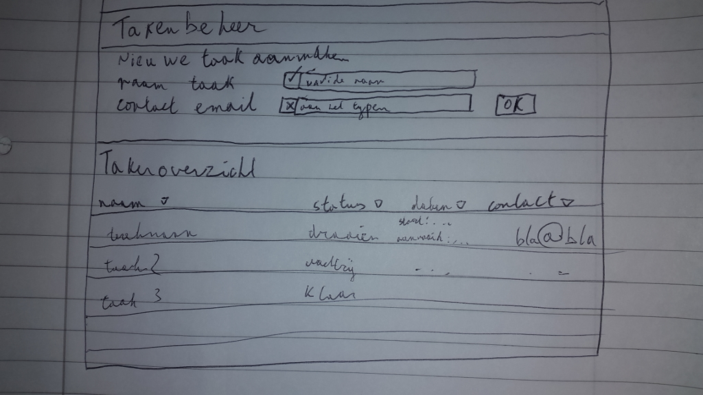

# Deel 2

## Welkom terug!

We gaan zo direct aan de slag, maar eerst een paar zinnetjes over de werkwijze. Werken met React dwingt je een beetje om van te voren een goed plan te maken van de compositie van je app. Dit doe je doorgaans met gebruikmaking van zogenaamde [jsx](https://reactjs.org/docs/jsx-in-depth.html) componenten. Een goede frontend is immers user-driven en dat wil je zowel functioneel zichtbaar maken in je code als visueel in je ontwerp.

Oh ja, LET OP: werkt iets niet zoals verwacht? Dit zijn de versies in de package.json:
```json
"devDependencies": {
  "babel-core": "6.26.0",
  "babel-loader": "7.1.4",
  "babel-plugin-transform-object-rest-spread": "6.26.0",
  "babel-preset-env": "1.6.1",
  "babel-preset-react": "6.24.1",
  "react": "16.2.0",
  "react-dom": "16.2.0",
  "webpack": "4.1.1",
  "webpack-cli": "2.0.12"
}
```

## Dus - wat gaan we maken?

We gaan een task manager maken met de volgende specs:
- Een takenoverzicht tonen met status van de taak
- Een formulier om nieuwe taken mee aan te maken

Het gaat er ongeveer zo uitzien:


Zoals je ziet ben ik in mijn oorspronkelijke schets al een startknop vergeten en heb ik te weinig ruimte gelaten voor datum informatie.

## JSX compositie

Het kan handig zijn om vooraf eerst een conceptueel totaaloverzicht te maken van de uiteindelijke structuur van je GUI, om het vervolgens op te breken in React [Components](https://reactjs.org/docs/components-and-props.html). Laten we dit nu doen:

```xml
<App>
  <Header>
    <h1>Takenbeheer</h1>
  </Header>

  <NewTask>
    <h2>Nieuwe taak aanmaken</h2>
    <TaskForm>
      <InputField>
        <label>Naam taak</label>
        <ValidBox />
        <input type="text" />
      </InputField>
      <InputField type="email">
        <label>Naam taak</label>
        <ValidBox />
        <input type="text" />
      </InputField>
      <button>Ok</button>
    </TaskForm>
  </NewTask>

  <TaskOverview>
    <h2>takenoverzicht</h2>
    <TaskTable>
      <TaskTableHeader>
        <Sortfield field="name">
          <span>Naam</span>
          <a>▾</a>
        </Sortfield>
        <Sortfield field="status">
          <span>Status</span>
          <a>▾</a>
        </Sortfield>
        <!-- TODO -->
      </TaskTableHeader>
      <TaskTableBody>
        <TaskRow>
          <span>taaknaam</span>
          <span>draaien</span>
          <!-- TODO -->
        </TaskRow>
      </TaskTableBody>
    </TaskTable>
  </TaskOverview>
</App>
```

Zo zie je dat zo'n kleine tekening, wanneer beschreven als XML (jsx bedoel ik), al een hoop functionele onderdelen bevat. Ga dit nu niet meteen copy-pasten of overtypen; het is nog steeds eens ontwerp.

We gaan in dit onderdeel alleen de header en het formulier doen, het takenoverzicht laten we nog even leeg.

## Hoe krijg ik dit ontwerp nu aan de praat?

Ik denk dat je nu toch echt React nodig hebt; ga verder in de map ```je-project``` waar je de vorige keer bent gebleven.

Installeer de packages ```react``` en ```react-dom``` en start alvast webpack weer op.
```sh
cd /pad/naar/je-project
npm install react react-dom --save-dev
npm start
```
Open ```src/index.js``` in je favoriete editor. En voeg de volgende code in.

```javascript
// react core library
import React from "react";
// react render functie
import ReactDOM from "react-dom";

// wanneer alle HTML verwerkt is
window.addEventListener("DOMContentLoaded", () => // fancy arrow-functie i.p.v. function() {  return Re..."app")); }
  // render de hallo wereld app in het html-element met id="app"
  ReactDOM.render(<div>Hallo wereld</div>, document.getElementById("app"))
);
```

LET OP: zet geen quotes heen om die divjes. Het _is_ geen html, het is jsx. Lees hier wat achtergrond over de [virtual DOM](https://calendar.perfplanet.com/2013/diff/): waarom vonden de lui van Facebook html DOM manipulatie niet goed genoeg?

LET OP: lees [hier](https://developer.mozilla.org/en-US/docs/Web/JavaScript/Reference/Functions/Arrow_functions) alles over arrow functies, ze doen meer dan alleen concise zijn: de belangrijkste feature is scope (waar ```this``` heen verwijst binnen de arrow functie, is de ```this``` van de aanroepende context...)

Vergeet ook niet in je ```index.html``` een element met id="app" toe te voegen aan de body:
```html
<html>
	<head><meta charset="utf-8"></head>
	<body>
		<div id="app"></div>
		<script src="dist/main.js"></script>
	</body>
</html>
```

En open je index.html in de browser. Als je je console opent zul je de volgende melding(en) zien:
- Download the React DevTools for a better development experience: [https://fb.me/react-devtools](https://fb.me/react-devtools)
- You might need to use a local HTTP server (instead of file://): [https://fb.me/react-devtools-faq](https://fb.me/react-devtools-faq)

Het eerste goedbedoelde advies kun je zeker opvolgen. Het maakt geen onderdeel uit van deze cursus.
Het tweede advies pakken we later even op wanneer we ajax gaan doen (of misschien heb je het al).

## Je eerste component

Hoe'n grote voorstander ik ook ben van bottom-up werken, een React app bouwen begin je top-down. Dus ons eerste component gaat App heten.

Maak deze directory en file aan ```src/components/App.js``` met de volgende inhoud:
```javascript
import React from "react";

class App extends React.Component {

  render() {
    return (
      <div>waar is mijn hallo wereld heen?</div>
    );
  }
}
export default App;
```

En pas ```src/index.js``` aan als volgt:

```javascript
import React from "react";
import ReactDOM from "react-dom";

import App from "./components/App";

window.addEventListener("DOMContentLoaded", () =>
  ReactDOM.render(
    <App>
      Hallo wereld
    </App>,

  document.getElementById("app"))
);
```

Als je nu kijkt in de browser zie je: "waar is mijn hallo wereld heen?". Dat komt doordat je App component zijn kinderen niet toont. Onderdeel van GUI compositie is de keuze te maken tussen het meegeven van jsx componenten als kinderen van je component, of je component zelf eigenaar laten zijn van zijn eigen kinderen. Dit is een afweging die afhangt van verschillende factoren als zelfdocumenterendheid van jsx, overzichtelijkheid van je ontwerp en van _welk_ component de baas moet zijn van de _state_ van het kind. Grosso modo, wil je 'globalere' controle, laat het component kinderen doorgeven, anders laat het component zelf zijn eigen kinderen '_shippen_'. Meestal is een component dat meer bedoeld is als layout container geschikter om kinderen te ontvangen, maar dat is ook niet zonder meer waar.

Gewoon doorgaan, al dit soort overwegingen voelen zinvoller alnaargelang je de opdrachtjes uitvoert.

Pas ```src/components/App.js``` als volgt aan:
```javascript
import React from "react";

class App extends React.Component {

  render() {
    return (
      <div>{this.props.children}</div>
    );
  }
}
export default App;
```

Binnen ```jsx``` kun je curly braces gebruiken om variabelen terug te printen. Elk React Component heeft _props_ en elk React Component met kinderen heeft de prop genaamd _children_.

Als je nu de pagina herlaadt staat er weer "Hallo wereld".

## Andere kinderen

Volgens ons oorspronkelijke ontwerp hierboven heeft de App 3 directe kinderen:
- Header
- NewTask
- TaskOverview

Die gaan we alvast aanmaken. Het is ook handig om in dit stadium na te gaan denken over de module structuur die je gaat gebruiken. Er gaan nogal wat Component classes bij komen en om ze nou allemaal direct in het mapje ```src/components``` te zetten maakt de boel wat minder overzichtelijk.

Daarom stel ik voor dat je deze files en directories vast aanmaakt (maar hoe je dit indeelt is nooit in steen gegoten)
- ```src/components/layout/Header.js```
- ```src/components/task-management/NewTask.js```
- ```src/components/task-overview/TaskOverview.js```

En dan zetten we de volgende code in die files.

Header.js
```javascript
import React from "react";

const Header = (props) => (
  <div className="header">
    <span style={{float: "right", color: "#aaa"}}>versie {props.versie}</span>
    <h1 style={{width: "calc(100% - 250px)"}}>{props.children}</h1>
  </div>
);

export default Header;
```
Deze code demonstreert wat kleine features.
Sinds React 0.14 kun je [stateless functional components](https://hackernoon.com/react-stateless-functional-components-nine-wins-you-might-have-overlooked-997b0d933dbc) doen; het wordt aangemoedigd.
Inline styles. Deze kun je meegeven als plain (camelCased) javascript objecten. Mijn voorkeur heeft nog steeds css via stylesheets, maar in React-land schijnen de meningen hierover verdeeld te zijn. Zoals je ziet staan er nu dubbele curlies om die styles heen. De eerste nesting is gewoon de instructie aan jsx om dit te behandelen als een variabele (voor een _prop_ genaamd ```style``` welteverstaan).

Ik heb ook maar een extra prop meegegeven genaamd ```versie```. In jsx worden props dus meegegeven met de syntax van een XML attribuut. Als het een constante string-waarde is gebruiken we dubbele quotes, anders altijd curlies.

Je kunt het trouwens nog extremer doen met object destructuring in de parameterlijst van de functie (dan zie je het hele argument genaamd props niet meer), maar voor de vorm toon ik nog een kortere versie hiervan:
Header.js (niet meer zo zelfdocumenterend)
```javascript
import React from "react";

export default ({ versie, children}) => (
  <div className="header">
    <span style={{float: "right", color: "#aaa"}}>versie {versie}</span>
    <h1 style={{width: "calc(100% - 250px)"}}>{children}</h1>
  </div>
);
```

NewTask.js
```javascript
import React from "react";

const NewTask = () => (
  <div className="new-task">
    <h2>Nieuwe taak aanmaken</h2>
    <div>TODO: Formulier</div>
  </div>
);

export default NewTask;
```

TaskOverview.js
```javascript
import React from "react";

class TaskOverview extends React.Component {

  render() {
    return (
      <div>
        <h2>Takenoverzicht</h2>
        <div>
          TODO: takenoverzicht
        </div>
      </div>
    );
  }
}
export default TaskOverview;
```

En in ```index.js``` kun je deze nieuwe componenten kwijt als kinderen van App.
```javascript
import React from "react";
import ReactDOM from "react-dom";

import App from "./components/App";
import Header from "./components/layout/Header";
import NewTask from "./components/task-management/NewTask";
import TaskOverview from "./components/task-overview/TaskOverview";

window.addEventListener("DOMContentLoaded", () =>
  ReactDOM.render(
    <App>
      <Header versie="0.0.1">Takenbeheer</Header>
      <NewTask />
      <TaskOverview />
    </App>,

  document.getElementById("app"))
);
```

Bekijk het eens in de browser.

## Leuk en aardig, maar het ziet er niet uit!

Toch maar iets over css en react dan. Door je jsx elementen op te tuigen met classnames kun je css toevoegen.

We plukken even bootstrap van een cdn in index.html:
```html
<html>
	<head>
		<meta charset="utf-8">
		<link href="https://maxcdn.bootstrapcdn.com/bootstrap/4.0.0/css/bootstrap.min.css" rel="stylesheet" integrity="sha384-Gn5384xqQ1aoWXA+058RXPxPg6fy4IWvTNh0E263XmFcJlSAwiGgFAW/dAiS6JXm" crossorigin="anonymous">
	</head>
	<body>
		<div id="app"></div>
		<script src="dist/main.js"></script>
	</body>
</html>
```

En renderen onze componenten net een beetje anders:

Header.js
```javascript
import React from "react";

const Header = (props) => (
  <div className="navbar">
    <div className="navbar-header">
      <div className="navbar-brand">{props.children}</div>
    </div>
    <span className="navbar-right" style={{color: "#aaa"}}>versie {props.versie}</span>
  </div>
);

export default Header;
```

NewTask.js
```javascript
import React from "react";

const NewTask = () => (
  <div className="card">
    <div className="card-header">Nieuwe taak aanmaken</div>
    <div className="card-body">TODO: Formulier</div>
  </div>
);

export default NewTask;
```

TaskOverview.js
```javascript
import React from "react";

class TaskOverview extends React.Component {

  render() {
    return (
      <div className="card">
        <div className="card-header">Takenoverzicht</div>
        <div className="card-body">TODO: takenoverzicht</div>
      </div>
    );
  }
}
export default TaskOverview;
```

App.js
```javascript
import React from "react";

class App extends React.Component {

  render() {
    return (
      <div className="container">{this.props.children}</div>
    );
  }
}
export default App;
```

Zo. Genoeg over css.

## Dat is leuk, maar het _doet_ niets! Props en state
Ja, javascript is natuurlijk niet één of andere render-engine voor jsx.

We gaan nu een klein beetje dynamiek introduceren met behulp van _state_ en _props_ in het formulier voor nieuwe taak aanmaken.

We maken nu de nieuwe componenten
- ```src/components/task-management/TaskForm.js```
- ```src/components/form-util/InputField.js```
- ```src/components/form-util/ValidBox.js```

Die we gaan toevoegen via de al bestaande ```NewTask.js```:
```javascript
import React from "react";

import TaskForm from "./TaskForm";

const NewTask = () => (
  <div className="card">
    <div className="card-header">Nieuwe taak aanmaken</div>
    <div className="card-body">
      <TaskForm />
    </div>
  </div>
);

export default NewTask;
```

TaskForm.js:
```javascript
import React from "react";
import InputField from "../form-util/InputField";

const TaskForm = () => (
  <div>
    <InputField label="Taaknaam" />
    <InputField label="Contact email" type="email" />
    <button className="btn btn-default">Ok</button>
  </div>
);

export default TaskForm;
```

ValidBox.js
```javascript
import React from "react";

const ValidBox = (props) => (
  <div className="input-group-prepend">
    <div className="input-group-text">{props.isValid ? "✔" : "✘"}</div>
  </div>
);

export default ValidBox;
```

InputField.js
```javascript
import React from "react";
import ValidBox from "./ValidBox";

class InputField extends React.Component {
  constructor(props) {
    super(props);

    this.state = {
      isValid: false,
      value: ""
    };
  }

  render() {
    const { isValid, value } = this.state;
    const { label } = this.props;
    return (
      <div className="form-row row">
        <label className="col-md-2">{label}</label>
        <div className="input-group col-md-10">
          <ValidBox isValid={isValid} />
          <input type="text" className="form-control" value={value} />
        </div>
      </div>
    );
  }
}
export default InputField;
```

Hier zie je weer wat nieuwe dingen:
- Een override op de constructor
- Waardes die uitgelezen worden uit ```this.state``` naast ```this.props```

De props zijn doorgegeven door het parent component en worden behandeld als constante waarde binnen de scope van dit component. Je _mag_ er dan ook niet aankomen van React.

De state wordt gedeclareerd binnen de scope van dit component en dit component is zelf de baas over zijn state. Dus waar ```isValid``` een _prop_ is voor het component ValidBox is het een _state_ voor het component InputField. We laten straks InputField bepalen of iets _valid_ is.

Als je de nieuwe versie van je app bekijkt in de browser en iets probeert in te voeren in je input veld gebeurt er niks. React is nu de baas van je events en React wil dat je ```onChange``` de _state_ verandert.

## Dat is leuk, maar het doet _nog steeds_ niets! Props en state manipulatie

Het aanpassen van de _state_ van een component MOET met de Component method ```setState```.

Want het aanpassen van eender welke waarde dan ook, of het nu een _prop_ is of een _state_ triggert een rerender van de hele boom (vanaf het component waarin de state change plaatsvindt). Zoals je heel snel gaat zien (in Deel 3) wordt een App in zijn geheel _vaak_ gererendered. Er zijn meerdere mechanismen om de hoeveelheid rerenders te onderdrukken, waaronder de (beetje gevaarlijke) lifecycle methode ```shouldComponentUpdate```.

LET OP: Lees [hier](https://reactjs.org/docs/react-component.html) meer over de Component lifecycle methodes.

Pas nu ```InputField.js``` aan als volgt:
```javascript
// (...)
class InputField extends React.Component {
  // (...)
  onValueChange(ev) {
    this.setState({
      value: ev.target.value,
      isValid: false /* TODO: validate */
    });
  }

  render() {
    const { isValid, value } = this.state;
    const { label } = this.props;
    return (
      <div className="form-row row">
        <label className="col-md-2">{label}</label>
        <div className="input-group col-md-10">
          <ValidBox isValid={isValid} />
          <input onChange={this.onValueChange.bind(this)} type="text" className="form-control" value={value} />
        </div>
      </div>
    );
  }
}
// (...)
```

Open in de browser. Elke keer dat een gebruiker iets typt in een invoerveld wordt het gehele component InputField opnieuw naar de DOM geprint. Dat lijkt inefficient, maar, getuige de verwijzing hierboven, is blijkbaar het tegendeel waar. React zorgt er voor dat je caret-positie behouden wordt binnen de input en effectief werkt alles gewoon zoals de gebruiker gewend is (anders zou niemand ooit React gebruiken).

LET OP: de aanroep in het onChange attribuut (de _prop_) ziet er nu zo uit:
```javascript
this.onValueChange.bind(this)
```
Het mag ook zo:
```javascript
(ev) => this.onValueChange(ev)
```
Maar dit gaat niet werken (WANT: ```this``` in de scope van de callback functie is niet meer de class genaamd InputField).
```javascript
this.onValueChange
```
Wat ik vaak doe is inlinen direct naar ```setState```
```javascript
(ev) => this.setState({value: ev.target.value})
```

Dan nu de validatie. Als je goed hebt opgelet geeft het component TaskForm een _prop_ mee genaamd _type_ aan één van de inputvelden. Die gaan we gebruiken om een type validatie te kiezen. Dit kan natuurlijk veel netter dan het voorbeeld hieronder maar wat ik hoop te illustreren is hoe de _state_ van InputField via de _prop_ isValid een rerender forceert van de ValidBox (als je goed hebt gelezen gebeurt dat sowieso al elke keer als de gebruiker iets intypt, maar het concept moet in ieder geval helder zijn):


```javascript
// (... in InputField ...)
onValueChange(ev) {
  const { type } = this.props;
  const newValue = ev.target.value;
  this.setState({
    value: newValue,
    isValid: type === "email"
      ? !!newValue.match(/.+\@.+\..+/) // lelijke email validatie
      : newValue.length > 2 // default validatie (type is undefined)
  });
}
```

Als je iets corrects intypt wordt nu het kruisje in de ValidBox een vinkje. Totdat je het weer invalide maakt.

## Recap

Je hebt nu het nodige gedaan met React. Eigenlijk heb je zo'n beetje kennisgemaakt met héél React. Maar dan doemen er vragen op:
- Er is een Ok knop in de parent van de InputFields. Hoe weet ik nu of de invoer valide was zodat ik de knop kan enablen/disablen?
- Als ik een taak toevoeg, hoe vertel ik nou aan het te maken TaskOverview component welke taken er zijn aangemaakt?
- Hoe laat ik de Ok knop eigenlijk een taak toevoegen?

Voor ál dit soort problemen heeft React _geen_ oplossing gemaakt. Dat hebben ze lekker aan de _community_ overgelaten met een mooi praatje over:
[Flux architecture](https://medium.com/@cabot_solutions/flux-the-react-js-application-architecture-a-comprehensive-study-fd2585d06483)
Sure, ze hebben zelf wel wat voorbeeldcode gemaakt, maar weinig mensen leken het te snappen. Zodoende zijn er allemaal _community_-driven _patterns_ ontstaan.

Je kunt het stukje hierboven lezen (maar graag geen code overnemen!).
Je kunt ook gewoon Deel 3 gaan _doen_.

Trust me.

Ga Deel 3 doen.

Nu.
